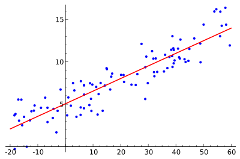

# 线性回归

​	线性回归是比较简单的机器学习算法，通常作为机器学习入门第一课。线性回归属于线性模型的一部分。下面来看一下线性模型的定义：

> **线性模型**：给定由 d 个属性描述的示例 $\boldsymbol{x}=\left(x_{1} ; x_{2} ; \ldots ; x_{d}\right)$，其中 $x_i$ 是 $x$ 在第 i 个属性上的取值，线性模型(linear model) 试图学得一个通过属性的线性组合来进行预测的函数，即
> $$f(\boldsymbol{x})=w_{1} x_{1}+w_{2} x_{2}+\ldots+w_{d} x_{d}+b$$
> 

> 一般向量形式写成：
> $$f(\boldsymbol{x})=\boldsymbol{w}^{\mathrm{T}} \boldsymbol{x}+b$$
> 其中
> $$w=(w_{1} ; w_{2} ; \ldots ; w_{d})$$
> $w$ 和 $b$ 学得后，模型就得以确定

简单地说就是找到一条线使得这些点都在这条直线上或者直线的附近。

> 

线性模型的形式简单，并且容易建模，但是其中蕴涵了机器学习的一些重要思想。许多功能更为强大的非线性模型可在线性模型的基础上通过引入层级结构或高维映射而得。

线性回归便是线性模型中最经典的模型之一

**线性回归**：给定数据集 $D=\{(x_{1}, y_{1}),(x_{2}, y_{2}), \ldots,(x_{m}, y_{m})\}$，其中 $x_{i}=(x_{i 1}..x_{i 2} ; \ldots ; x_{i d}), y_{i} \in \mathbb{R}$

"线性回归" (linear regression) 试图学得一个线性模型以尽可能准确地预测实值输出标记.

按照线性模型的思想，设 x 是特征，y 是真实值，我们需要找到能够一条尽可能让 $f(x)=y$ 的曲线 $f(x)=wx+b$，也就是找到对应的 w 和 b 。

关键在于衡量 $f(x)$ 与 $y$ 的差别

均方误差 (2.2) 是回归任务中最常用的性能度量，因此我们可试图让均

方误差最小化，即

$$(w^\*, b^\*)=\underset{(w, b)}{\arg \min}\sum_{i=1}^{m}(f(x_{i})-y_{i})^{2}=\underset{(w, b)}{\arg \min}\sum_{i=1}^{m}(y_{i}-w x_{i}-b)^{2}$$

​		均方误差有非常好的几何意义，它对应了常用的欧几里得距离。基于均方误差最小化来进行模型求解的方法称为“最小二乘法”。在线性回归中，最小二乘法就是试图找到一条直线，使所有样本到直线上的欧式距离之和最小。

​		求解 $w$ 和 $b$ 使 
$$E_{(w, b)}=\sum_{i=1}^{m}(y_{i}-w x_{i}-b)^{2}$$
最小化的过程，称为线性回归模型的最小二乘“参数估计”。我们可将 $E_{(w,b)}$ 分别对 $w$ 和 $b$ 求导，得到：
$$\frac{\partial E_{(w, b)}}{\partial w}=2(w \sum_{i=1}^{m} x_{i}^{2}-\sum_{i=1}^{m}(y_{i}-b) x_{i})$$
$$\frac{\partial E_{(w, b)}}{\partial b}=2(m b-\sum_{i=1}^{m}(y_{i}-w x_{i}))$$
​		然后令上两式为 0 可得到 $w$ 和 $b$ 最优解的闭式解：

$$w=[\sum_{i=1}^{m} y_{i}(x_{i}-\bar{x})] {\div} [\sum_{i=1}^{m} x_{i}^{2}-\frac{1}{m}(\sum_{i=1}^{m} x_{i})^{2}]$$
$$b=\frac{1}{m} \sum_{i=1}^{m}\left(y_{i}-w x_{i}\right)$$

其中
$$\bar{x}=\frac{1}{m} \sum_{i=1}^{m} x_{i}$$
为 $x$ 的均值。

​		更一般的情形是如本节开头的数据集 D ,样本由 d 个属性描述，此时我们试图学得
$f(x_{i})=w^{\mathrm{T}} x_{i}+b$,  使得 $f(x_{i}) \simeq y_{i}$

这就是多元线性回归

